# Testing the Document Management Application

This section provides a comprehensive guide to testing the entire document management application. We'll walk through each step of the application flow to ensure all features work correctly.

## Prerequisites for Testing

Before beginning the testing process, ensure you have:

- A compatible browser (Chrome, Firefox, or Brave recommended)
- A Web3 wallet with test tokens (Razor recommended)
- Test files for upload (.pdf, .docx formats work best)
- Multiple wallet addresses for testing the multi-signature functionality

## Step 1: Testing the Home Page and Wallet Connection

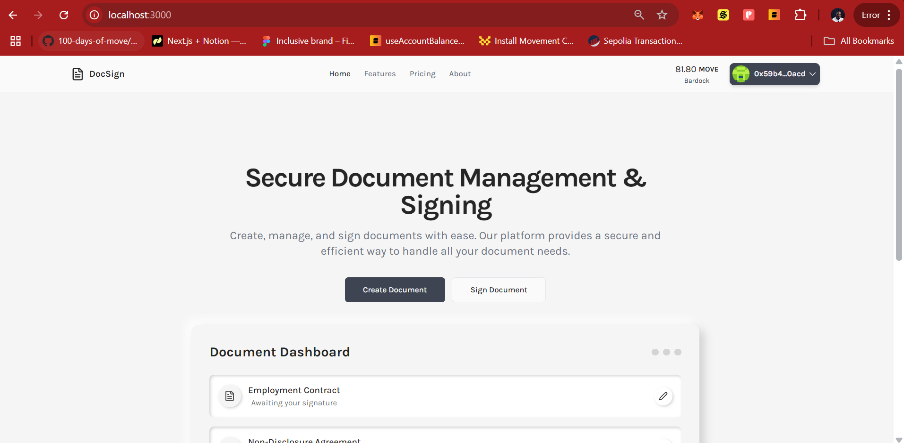

**Test Procedure:**

1. Navigate to the application's homepage
2. Click the "Connect Wallet" button in the top right corner
3. In the wallet popup, approve the connection request
4. Verify that:
   - Your wallet address appears in the header
   - Your wallet balance is displayed correctly
   - The dashboard shows the menu options (Create Document, Sign Document)

**Expected Result:** The wallet connects successfully, and you can see your wallet address truncated in the header (e.g., 0x123...abc).

## Step 2: Testing Document Creation

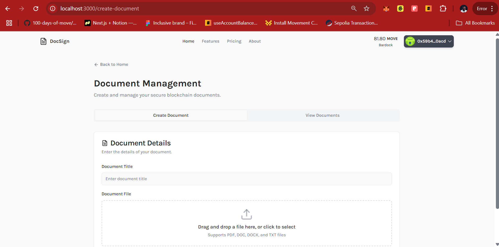

**Test Procedure:**

1. From the connected home page, click on "Create Document"
2. Verify that the document creation form loads correctly with fields for:
   - Document name
   - Document file upload
3. Check that all form validations work:
   - Empty document name shows an error
   - Invalid file type shows an error

**Expected Result:** The document creation page loads correctly with all form elements visible and validation working.

## Step 3: Testing File Upload

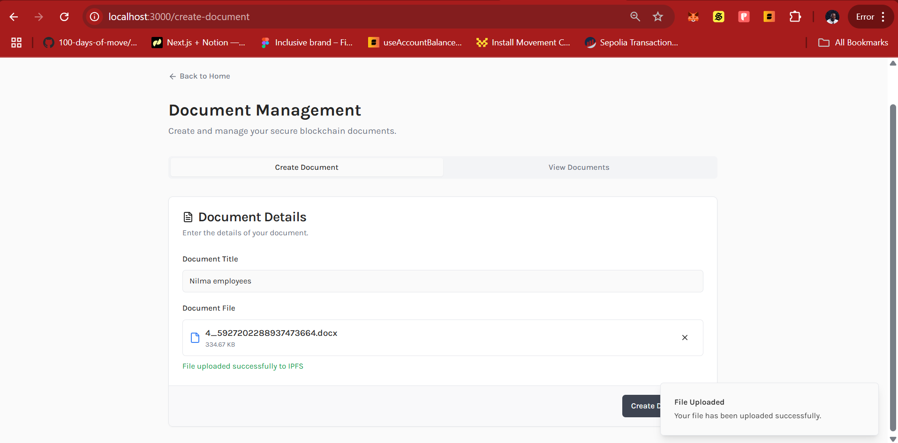

**Test Procedure:**

1. On the create document page, drag and drop the document or click the upload card component
2. Select a test document from your local machine
3. Verify that:
   - The file name appears after selection
   - A message is displayed when the file upload successfully

**Expected Result:** The file uploads successfully and shows file information.

## Step 4: Testing Blockchain Document Storage

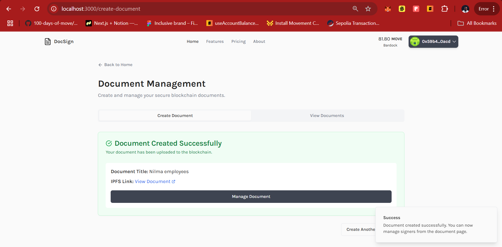

**Test Procedure:**

1. After entering document details and uploading a file, click "Create Document"
2. Confirm the transaction in your wallet when prompted
3. Wait for the blockchain transaction to complete
4. Verify that:
   - The system shows a success message
   - The transaction can be viewed on the blockchain explorer

**Expected Result:** The document is successfully stored on the blockchain and the transaction completes with a success message.

## Step 5: Testing Document Listing

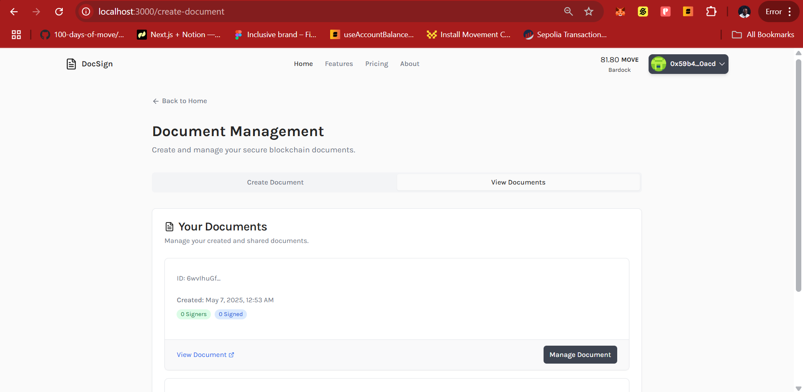

**Test Procedure:**

1. Click the "View Documents" tab
2. Verify that:
   - All documents created by your wallet are listed
   - Each document shows:
     - Document name
     - Creation date
     - Number of signers and number of signers that have signed the document
     - Link to view the document hosted on IPFS/Pinata
   - Documents are sorted by creation date (newest first)

**Expected Result:** All documents created by the connected wallet are displayed correctly with their metadata and status.

## Step 6: Testing Document Management

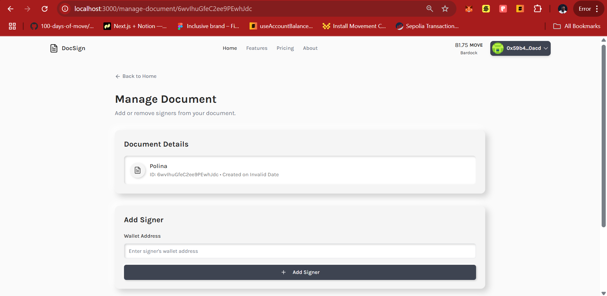

**Test Procedure:**

1. From the documents listing, click "Manage Document" on one of your documents
2. Verify that the document management page shows:
   - Document details (name, description, creation date)
   - Current signers list
   - Options to add or remove signers

**Expected Result:** The document management page loads correctly showing document details and management options.

## Step 7: Testing Adding Signers

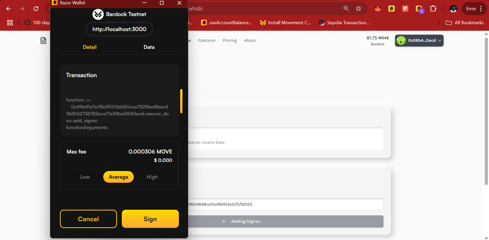

**Test Procedure:**

1. On the document management page, click "Add Signer"
2. Enter a valid wallet address in the input field
3. Click "Add Signer" to confirm
4. Verify that:
   - Duplicate signers are not allowed
   - The new signer appears in the signers list

**Expected Result:** A new signer is successfully added to the document and appears in the signers list.

## Step 8: Testing Signer Management

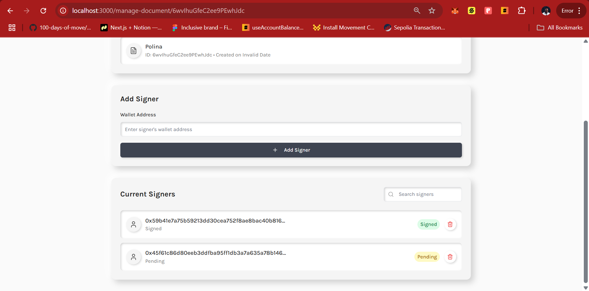

**Test Procedure:**

1. On the document management page, review the list of all allowed signers
2. Test removing a signer by clicking the "Remove" button next to their address
3. Confirm the removal action
4. Verify that:
   - The signer is removed from the list
   - The blockchain transaction for removal completes successfully
   - The updated signers list is displayed correctly

**Expected Result:** Signers can be successfully added and removed, with all changes reflected on the blockchain.

## Step 9: Testing Documents to Sign View

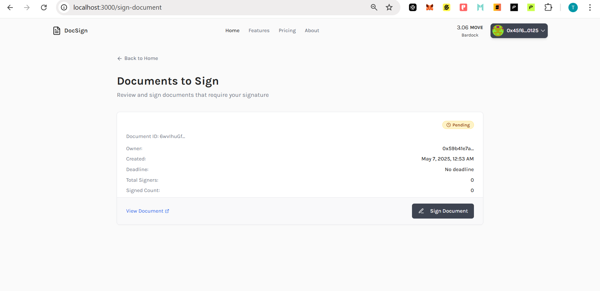

**Test Procedure:**

1. Switch to a different wallet that has been added as a signer to a document
2. Connect this wallet to the application
3. Click "Sign document" on the homepage
4. Verify that:
   - All documents where this wallet is listed as a signer appear
   - Each document shows:
     - Document name
     - Owner address
     - Creation date
     - Total Signer
     - Signature count

**Expected Result:** The new wallet can see all documents it's authorized to sign in the "Documents to Sign" section.

## Step 10: Testing the Document Signing Page

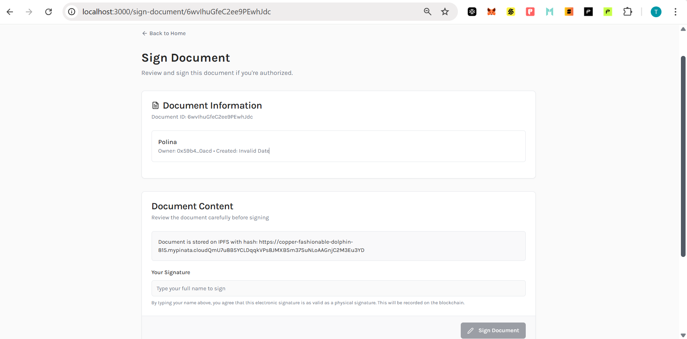

**Test Procedure:**

1. As the signer wallet, click "Sign Document" on a document requiring your signature
2. Verify that the signing page shows:
   - Document details
   - Signature confirmation section
   - List of current signatures

**Expected Result:** The document signing page loads correctly showing the document and signature controls.

## Step 11: Testing the Signing Process

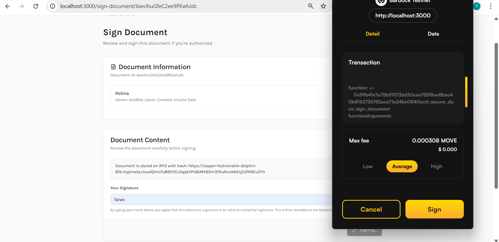

**Test Procedure:**

1. On the signing page, review the document content
2. Click the "Sign Document" button
3. Confirm the transaction in your wallet when prompted
4. Wait for the blockchain transaction to complete
5. Verify that:
   - The signature transaction completes successfully
   - You receive a confirmation message

**Expected Result:** The document is successfully signed, with the signature recorded on the blockchain.

## Step 12: Testing Signature Verification

**Test Procedure:**

1. After signing, check the document details page
2. Verify that:
   - Your signature appears in the "Current Signatures" list

**Expected Result:** All signatures are correctly recorded and displayed.

## What Next?

Now that we've successfully built and tested our document management DApp, here are three core features you can implement to enhance your application:

### 1. Document Versioning

**Benefits:**

- Provides a complete audit trail of document changes over time
- Prevents accidental overwrites of important document versions
- Enables tracking of who made changes and when, enhancing accountability

### 2. Automated Notification System

**Benefits:**

- Alerts signers immediately when documents require their signature
- Reduces time spent manually following up on pending documents
- Keeps all parties informed about document status changes in real-time

### 3. Document Templates with Role-Based Signing

**Benefits:**

- Significantly reduces document creation time for standard agreements
- Ensures consistency across similar document types
- Simplifies the signing process with predefined roles and workflows

Implementing these three features will transform your basic document management DApp into a more robust solution that can better serve real-world document workflow needs while maintaining the security and transparency benefits of blockchain technology.
